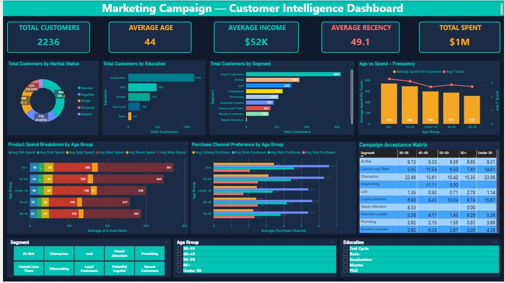
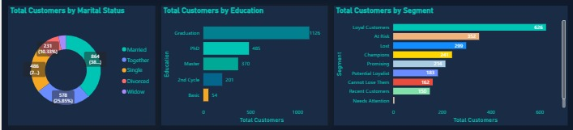
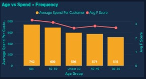
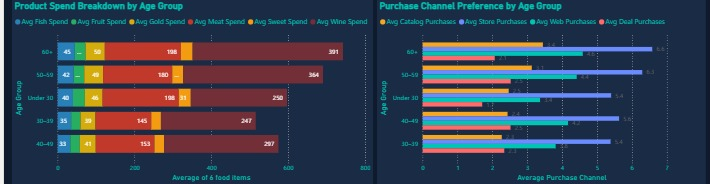

# 👥 Customer Segmentation Analysis Dashboard — Power BI

An interactive Power BI dashboard that analyzes customer demographics, income, and spending behavior to identify distinct customer segments and uncover high-value customer groups.

The project demonstrates how customer data can be transformed into actionable insights to support targeted marketing, customer retention, personalized campaigns, and data-driven business decisions.

---

## 📊 Project Overview

Customer segmentation enables businesses to understand differences in customer behavior and develop more targeted strategies.

This project analyzes customer demographic and behavioral data to identify customer groups based on factors such as:

* Age
* Gender
* Income
* Spending behavior
* Customer segment

The dashboard provides an interactive way to explore customer characteristics and identify opportunities for marketing optimization and customer value growth.

---

## 🎯 Project Objectives

The objectives of this project were to:

* Analyze customer demographics and purchasing behavior.
* Identify distinct customer segments.
* Discover high-value and low-value customer groups.
* Analyze relationships between income and spending behavior.
* Support targeted marketing and personalized campaigns.
* Identify opportunities for customer retention.
* Generate actionable business recommendations.

---

## 🛠️ Tools & Technologies

### Tools

* Microsoft Power BI
* Power Query
* DAX
* Data Modeling

### Analytical Techniques

* Data cleaning
* Data transformation
* Exploratory data analysis
* Customer segmentation
* Demographic analysis
* Income and spending analysis
* Data visualization
* Interactive dashboard development

---

## 📈 Dashboard Features

The interactive dashboard includes:

### 👤 Customer Overview

Provides a high-level summary of the customer base using key performance indicators.

### 👥 Demographics Analysis

Analyzes customer distribution across:

* Age groups
* Gender
* Customer segments

### 💰 Income & Spending Analysis

Explores relationships between:

* Customer income
* Spending behavior
* Customer value

### 🎯 Customer Segmentation

Groups customers based on behavioral and demographic characteristics to identify:

* High-value customers
* Low-value customers
* Potential growth segments
* Lower-engagement customer groups

### 📊 Interactive Visualizations

The dashboard includes:

* KPI cards
* Bar charts
* Column charts
* Pie and donut charts
* Scatter plots
* Slicers
* Interactive filters

---

## 📌 Key Performance Indicators

The dashboard tracks key metrics including:

* Total Customers
* Average Income
* Average Spending Score
* Customer Distribution by Gender
* Customer Distribution by Age Group
* High-Value Customer Count
* Customer Segment Distribution
* Income Distribution

---

## 🔍 Key Business Questions

This analysis helps answer questions such as:

* Which customer segments have the highest value?
* How does spending behavior vary across income groups?
* Which age groups demonstrate higher spending behavior?
* Are there observable differences in customer behavior by gender?
* Which customers could be targeted with premium products or services?
* Which customer groups may require additional engagement or retention efforts?
* How can customer segmentation support improved customer lifetime value?

---

## 💡 Business Insights

The dashboard provides a framework for identifying:

* High-value customer segments for retention and loyalty initiatives.
* Customer groups with strong income but lower spending potential.
* Lower-engagement segments that may benefit from targeted promotions.
* Demographic patterns that can support more personalized marketing.
* Relationships between income levels and customer spending behavior.

---

## 🚀 Business Recommendations

Based on the segmentation analysis, businesses can:

* Develop personalized marketing campaigns for different customer segments.
* Prioritize retention strategies for high-value customers.
* Create targeted promotions for lower-engagement customer groups.
* Tailor product offerings based on customer preferences and behavior.
* Use customer segmentation to improve customer lifetime value (CLV).
* Develop differentiated strategies for high-potential and low-potential customer groups.

---

## 📷 Dashboard Screenshots

### Dashboard Overview



### Customer Segmentation



### Demographics Analysis



### Spending Analysis



---

## 🎓 Skills Demonstrated

This project demonstrates practical experience in:

* Microsoft Power BI
* Power Query
* DAX
* Data Cleaning
* Data Transformation
* Data Modeling
* Customer Segmentation
* Customer Analytics
* Demographic Analysis
* Data Visualization
* Dashboard Design
* Business Intelligence
* KPI Development
* Data Storytelling
* Business Insight Generation

---

## 📂 Project Structure

```text
Customer-Segmentation-Analysis-Dashboard/
│
├── images/
│   ├── Dashboard-overview.png
│   ├── customer-segments.png
│   ├── demographics.png
│   └── spending-analysis.png
│
├── Customer-Segmentation-Analysis.pbix
└── README.md
```

---

## 👩‍💻 Author

**Jennifer Bitrus**

Data Analytics Portfolio Project

---

⭐ If you found this project helpful, consider giving the repository a star!
